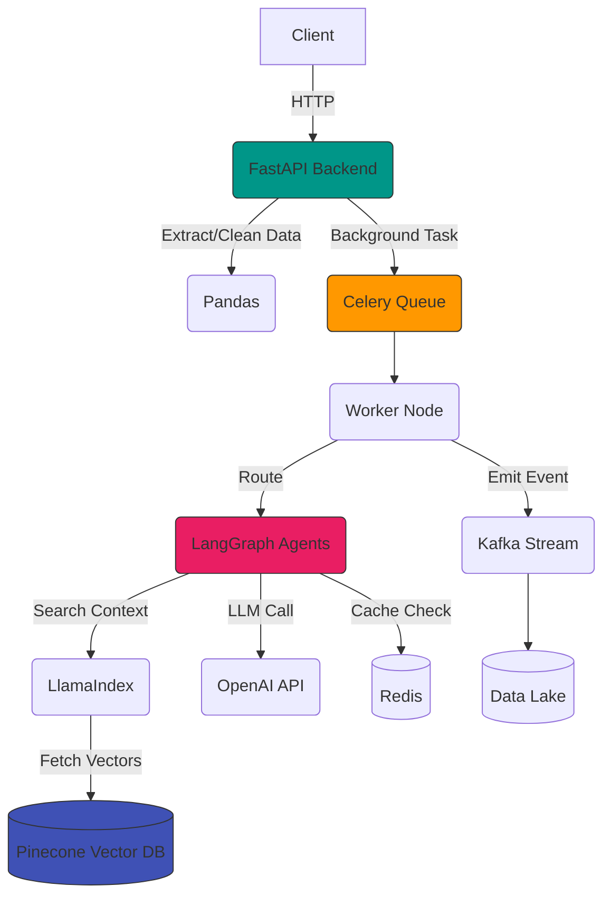

# Module 19: AI FDE Python Stack

Welcome to **Module 19**. This is the ultimate toolkit for an AI Forward Deployed Engineer. You are not building models from scratch using PyTorch; you are using the industry's best APIs, SDKs, and data infrastructure to build enterprise systems around foundational models.

---

## 1. Detailed Theory

### Core Utilities
- **`requests` / `httpx`**: The standard for making HTTP calls to external APIs.
- **`pandas` / `numpy`**: For data manipulation. Essential for preprocessing massive CSV/Parquet files before vectorization.

### AI Orchestration
- **OpenAI SDK**: The direct client for ChatGPT, Embeddings, and Whisper.
- **LangChain**: The most popular framework for chaining LLMs with tools, prompts, and memory.
- **LangGraph**: Built on LangChain, specifically designed for highly controllable, stateful, multi-agent workflows.
- **LlamaIndex**: The undisputed king of RAG (Retrieval-Augmented Generation) architectures and complex document chunking.

### Infrastructure & Message Brokers
- **Redis**: In-memory data store. Used for ultra-fast caching, rate limiting, and holding agent session state.
- **Celery**: Distributed task queue. When a user uploads a 500-page PDF, you don't block the API; you send it to Celery to process in the background.
- **Kafka**: Enterprise event streaming. Used in massive systems to route millions of agent logs or user events between microservices asynchronously.

### Vector Databases
- **Pinecone**: Fully managed, serverless vector database. High performance, zero infrastructure management.
- **ChromaDB**: Great open-source vector DB, perfect for local prototyping and medium-scale production.
- **FAISS**: Facebook AI Similarity Search. A highly optimized C++ library with Python bindings for running similarity search strictly in memory.

---

## 2. Architecture Diagram: The Ultimate AI FDE Stack



---

## 3. Production Use Cases

1. **Async RAG Pipeline (FastAPI + Celery + LlamaIndex + Pinecone)**: A user uploads a 100MB financial report. FastAPI returns `202 Accepted` immediately. Celery picks up the file, uses LlamaIndex to chunk it, generates embeddings via OpenAI, and upserts them to Pinecone. Redis is used to track the job status so the UI can poll for completion.
2. **Multi-Agent Collaboration (LangGraph)**: A coding agent generates a script, passes it to a QA agent, which passes it to an Execution agent. If it fails, the state loops back to the coding agent.
3. **High-Throughput Analytics (Kafka)**: Every single token generated by 5,000 internal enterprise agents is streamed via Kafka to a Snowflake data warehouse for compliance and billing.

---

## 4. Real Company Examples

- **Harvey AI / Ironclad**: Legal AI companies that heavily utilize LlamaIndex for complex document hierarchical parsing and chunking before sending context to LangChain agents.
- **Scale AI**: Relies on massive Celery and Kafka clusters to route millions of data labeling tasks between human workers and AI validation models asynchronously.

---

## 5. Coding Examples

### LlamaIndex + Pinecone + OpenAI (The RAG Trinity)
*Pre-requisite: `pip install llama-index pinecone-client openai`*

```python
import os
from llama_index.core import VectorStoreIndex, SimpleDirectoryReader
from llama_index.vector_stores.pinecone import PineconeVectorStore
from llama_index.core import StorageContext
from pinecone import Pinecone

# 1. Initialize Pinecone
pc = Pinecone(api_key=os.environ.get("PINECONE_API_KEY"))
pinecone_index = pc.Index("enterprise-rag")

# 2. Setup LlamaIndex Storage Context to point to Pinecone
vector_store = PineconeVectorStore(pinecone_index=pinecone_index)
storage_context = StorageContext.from_defaults(vector_store=vector_store)

def ingest_documents(directory_path: str):
    print(f"Reading docs from {directory_path}...")
    documents = SimpleDirectoryReader(directory_path).load_data()
    
    print("Chunking, Embedding, and Upserting to Pinecone...")
    # This automatically calls OpenAI embeddings and upserts to Pinecone!
    index = VectorStoreIndex.from_documents(
        documents, 
        storage_context=storage_context
    )
    print("Ingestion complete.")

def query_system(query: str):
    # Load index from existing Pinecone store
    index = VectorStoreIndex.from_vector_store(vector_store=vector_store)
    
    # Query Engine automatically creates embedding for query, searches Pinecone, 
    # retrieves top K chunks, and sends to OpenAI LLM for final answer!
    query_engine = index.as_query_engine()
    response = query_engine.query(query)
    
    print(f"Q: {query}")
    print(f"A: {response}")

# Usage:
# ingest_documents("./data")
# query_system("What is the Q3 revenue target?")
```

### LangGraph Agent (Simplified State Machine)
```python
from langgraph.graph import StateGraph, END
from typing import TypedDict, Annotated
import operator

# 1. Define the State
class AgentState(TypedDict):
    messages: Annotated[list, operator.add]
    requires_human: bool

# 2. Define Node Functions
def triage_node(state: AgentState):
    msg = state['messages'][-1]
    # Fake LLM logic
    if "angry" in msg.lower():
        return {"requires_human": True}
    return {"requires_human": False}

def auto_reply_node(state: AgentState):
    return {"messages": ["Auto-reply: We will look into this."]}

def human_escalation_node(state: AgentState):
    return {"messages": ["System: Escalated to human operator."]}

# 3. Define Conditional Routing
def route_after_triage(state: AgentState):
    if state.get("requires_human"):
        return "human"
    return "auto"

# 4. Build the Graph
workflow = StateGraph(AgentState)
workflow.add_node("triage", triage_node)
workflow.add_node("auto", auto_reply_node)
workflow.add_node("human", human_escalation_node)

workflow.set_entry_point("triage")
workflow.add_conditional_edges("triage", route_after_triage, {
    "human": "human",
    "auto": "auto"
})
workflow.add_edge("auto", END)
workflow.add_edge("human", END)

app = workflow.compile()

# Usage
# print(app.invoke({"messages": ["I am angry!"]}))
```

---

## 6. Hands-on Labs

**Lab: The Local FAISS Engine**
**Objective**: Build a local similarity search without the cloud.
*Pre-requisite: `pip install faiss-cpu sentence-transformers`*
**Instructions**:
1. Import `faiss` and `SentenceTransformer`.
2. Load a local, free embedding model: `model = SentenceTransformer('all-MiniLM-L6-v2')`.
3. Create a list of sentences: `["I love dogs", "The stock market crashed", "Puppies are great"]`.
4. Create embeddings: `embeddings = model.encode(sentences)`.
5. Create a FAISS index: `index = faiss.IndexFlatL2(384)` (384 is the embedding dimension).
6. `index.add(embeddings)`.
7. Encode a query `"Tell me about cute animals"` and search: `D, I = index.search(query_embedding, k=2)`.
8. Print the matched sentences using the indices in `I`.

---

## 7. Assignments

**Assignment: Celery Mock Architecture**
1. Read the Celery documentation on setting up a basic worker.
2. In `tasks.py`, define a Celery app (using a local Redis server as the broker).
3. Create a `@app.task` called `process_document(file_name: str)`. Inside, do `time.sleep(10)` and `return "Done"`.
4. In `api.py`, write a fake FastAPI endpoint that calls `process_document.delay("report.pdf")` and immediately returns `{"status": "Processing Started", "task_id": ...}`.
5. Notice how the API doesn't hang for 10 seconds!

---

## 8. Interview Questions

1. **Why use LlamaIndex instead of LangChain for Document Ingestion?**
   *Answer Hint: While LangChain can do RAG, LlamaIndex is purpose-built for it. It offers advanced chunking (hierarchical, semantic), advanced retrieval (BM25 + Vector reranking), and out-of-the-box data connectors (Google Drive, Notion) that make building enterprise data pipelines much easier.*
2. **What is the difference between Redis and Celery?**
   *Answer Hint: Redis is an in-memory database/message broker. Celery is a distributed task queue framework. Celery actually *uses* Redis under the hood as its broker to send tasks to workers.*
3. **What is a "Stateful" multi-agent workflow?**
   *Answer Hint: A system where agents pass a shared 'State' (like a dictionary of variables or memory) between each other. As opposed to stateless APIs, stateful workflows (like LangGraph) allow agents to remember previous steps, loop back to fix errors, and collaborate over long periods.*

---

## 9. Best Practices (FDE Standards)

- **Do NOT put LLM logic inside Celery tasks directly if possible**: If an LLM call takes 30 seconds, and you have 1000 tasks, your Celery workers will block. Use async frameworks (like `asyncio`) for network-bound LLM calls, and use Celery for CPU-bound data preprocessing/chunking.
- **Decouple your AI stack**: Don't hardcode `OpenAI` everywhere. Use LangChain's `BaseChatModel` or write your own abstraction so you can swap to Anthropic or a self-hosted LLaMA model in 5 minutes if the client demands it.

---

## 10. Common Mistakes

- **Memory Leaks in Pandas**: Loading a 10GB dataset into Pandas on a Kubernetes pod with 2GB of RAM. The pod will OOM (Out of Memory) crash instantly. *Fix: Use Pandas chunking (`read_csv(chunksize=1000)`), or switch to Polars/PySpark for massive data.*
- **Un-indexed Vector Searches**: Performing a brute-force exact KNN search on 10 million vectors. It will take forever. Ensure your Vector DB is using HNSW or IVF indexes for approximate nearest neighbor (ANN) search.
