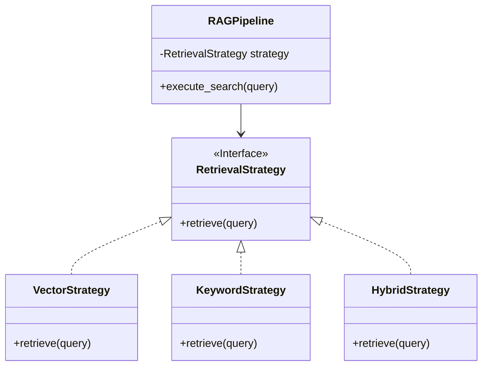

# Module 20: Design Patterns for AI FDEs

Welcome to **Module 20**. We have reached the final conceptual module. Writing code that works is easy. Writing code that is maintainable by a team of 50 engineers over 5 years is hard. Design Patterns are proven, battle-tested solutions to common software design problems. As an FDE, you must apply these patterns to the unpredictable world of AI.

---

## 1. Detailed Theory

### Creational Patterns (Object Creation)
- **Singleton**: Ensures a class has only *one* instance globally. Used for Database Connection Pools and logging clients.
- **Factory**: Creates objects without exposing the instantiation logic to the client. Used to instantiate different LLM providers (e.g., `get_llm("azure")` vs `get_llm("openai")`).

### Structural Patterns (Object Assembly)
- **Adapter**: Allows incompatible interfaces to work together. Crucial when integrating an enterprise's 15-year-old SOAP API into a modern AI agent's toolset.
- **Dependency Injection (DI)**: Passing dependencies (like a database) into an object rather than creating them inside. Makes testing and swapping components infinitely easier.

### Behavioral Patterns (Object Communication)
- **Strategy**: Defines a family of algorithms and makes them interchangeable. Used for swapping RAG retrieval strategies (e.g., `VectorSearch` vs `KeywordSearch` vs `HybridSearch`).
- **Observer (Pub/Sub)**: One object notifies many others of state changes. Used in streaming architectures (e.g., when a document finishes embedding, notify the UI, the analytics tracker, and the logging service).
- **Repository**: Abstracts data access logic. Your business logic shouldn't know if data comes from Postgres, Pinecone, or a CSV file.

---

## 2. Architecture Diagram: Strategy Pattern in RAG



---

## 3. Production Use Cases

1. **Singleton Database Connection**: Ensuring your FastAPI app doesn't create a new connection pool for every single request, which would crash PostgreSQL.
2. **Adapter for Legacy Tooling**: You want to give a LangChain agent a tool to "Check Inventory". The client's inventory system is a nasty XML-based API. You write an Adapter class that takes clean JSON from the Agent, translates it to XML, calls the legacy API, translates the XML response back to JSON, and returns it to the Agent.
3. **Repository Pattern for Vector DBs**: The client wants to start with ChromaDB (local) but move to Pinecone (cloud) later. You write a `VectorRepository` interface. You implement a `ChromaRepo` for now. Next month, you write a `PineconeRepo`. You swap them in `main.py` using Dependency Injection, and *zero* other code changes.

---

## 4. Real Company Examples

- **LangChain**: The entire library is essentially a masterclass in the Strategy and Factory patterns. `PromptTemplate` and `ChatModel` are abstractions allowing developers to swap underlying implementations dynamically.
- **Enterprise Spring/Java transitions**: Many clients you interact with as an FDE will have backend teams writing Java/Spring. They think strictly in Design Patterns. Speaking this language builds massive trust with enterprise stakeholders.

---

## 5. Coding Examples

### The Strategy Pattern (RAG Retrieval)
```python
from abc import ABC, abstractmethod

# 1. The Strategy Interface
class RetrievalStrategy(ABC):
    @abstractmethod
    def retrieve(self, query: str) -> list[str]:
        pass

# 2. Concrete Strategies
class VectorSearch(RetrievalStrategy):
    def retrieve(self, query: str) -> list[str]:
        print(f"[Vector] Performing semantic search for: {query}")
        return ["Doc A (Semantic match)"]

class BM25KeywordSearch(RetrievalStrategy):
    def retrieve(self, query: str) -> list[str]:
        print(f"[Keyword] Performing exact keyword match for: {query}")
        return ["Doc B (Keyword match)"]

# 3. The Context (The Pipeline)
class EnterpriseRAG:
    def __init__(self, strategy: RetrievalStrategy):
        # We inject the strategy via Dependency Injection!
        self._strategy = strategy
        
    def set_strategy(self, strategy: RetrievalStrategy):
        # Allow swapping strategy at runtime
        self._strategy = strategy
        
    def search(self, query: str):
        return self._strategy.retrieve(query)

# 4. Usage
query = "Q3 Finance Report"

# Start with Vector Search
rag_system = EnterpriseRAG(VectorSearch())
rag_system.search(query)

# Swap to Keyword search if the user specifically requests exact phrasing
rag_system.set_strategy(BM25KeywordSearch())
rag_system.search(query)
```

### The Singleton Pattern (Database Pool)
```python
import threading

class DatabasePool:
    _instance = None
    _lock = threading.Lock() # Thread-safe singleton
    
    def __new__(cls):
        # Double-checked locking pattern
        if cls._instance is None:
            with cls._lock:
                if cls._instance is None:
                    print("Initializing real DB connection pool...")
                    cls._instance = super(DatabasePool, cls).__new__(cls)
                    # Fake connection setup
                    cls._instance.connections = ["Conn1", "Conn2"]
        return cls._instance

# Usage
db1 = DatabasePool()
db2 = DatabasePool()

print(f"Are they the exact same object in memory? {db1 is db2}") # True!
```

---

## 6. Hands-on Labs

**Lab: The Adapter**
**Objective**: Make incompatible interfaces work together.
**Instructions**:
1. You have an existing class `ModernAgent` that calls `tool.execute_json({"query": "stock"})`.
2. The client provides a class `LegacySOAPService` with a method `send_xml_request(xml_string: str)`.
3. Create an `AgentToolAdapter` class that implements an `execute_json(self, payload)` method.
4. Inside `execute_json`, convert the JSON dictionary to a fake XML string, instantiate the `LegacySOAPService`, and call `send_xml_request`.

---

## 7. Assignments

**Assignment: The Repository Pattern**
1. Create an abstract class `DocumentRepository` with methods `save(doc)` and `get_all()`.
2. Create `SQLRepository` (implements methods by printing "Saved to SQL").
3. Create `MongoRepository` (implements methods by printing "Saved to Mongo").
4. Write a `main()` function that takes a `DocumentRepository` as an argument.
5. Pass `SQLRepository` to `main()`. Then change one line of code to pass `MongoRepository` to `main()`. Notice how the core logic didn't care about the database engine.

---

## 8. Interview Questions

1. **Why is the Singleton pattern sometimes considered an "anti-pattern"?**
   *Answer Hint: It introduces global state into an application, which makes unit testing difficult because the state persists across different tests. Dependency Injection is often a better alternative to Singletons.*
2. **Explain Dependency Injection (DI).**
   *Answer Hint: Instead of an object creating its own dependencies (e.g., `self.db = Database()`), the dependency is provided to it from the outside (e.g., `def __init__(self, db: Database):`). It enforces loose coupling.*
3. **In the context of AI, where is the Factory pattern most useful?**
   *Answer Hint: Instantiating different LLM models based on user tier or configuration. `AIFactory.get_model("gpt-4")` creates an OpenAI client, while `AIFactory.get_model("llama3")` creates an open-source HuggingFace client.*

---

## 9. Best Practices (FDE Standards)

- **Don't over-engineer**: If a script is 50 lines long to clean a CSV file, do not use 4 design patterns. Patterns introduce abstraction and boilerplate. Use them strictly in large, long-lived applications.
- **Interface Segregation**: If you create a base interface for an AI Agent, don't force it to have 50 methods. Split it into `Readable`, `Writable`, `Executable` interfaces so classes only implement what they actually need.

---

## 10. Common Mistakes

- **God Classes**: Creating a `MainManager` class that handles database connections, LLM generation, API routing, and logging. This violates the Single Responsibility Principle. Use the patterns to break this up into composed, separate classes.

---

## 11. End-to-End Project: Enterprise Observer System

**Scenario**: When a document is processed by your pipeline, multiple things need to happen asynchronously: the Analytics team needs a log, the Billing team needs to track token usage, and the UI needs a push notification. You will use the Observer pattern.

**Code:**
```python
# --- Observer Interfaces ---
class Observer:
    def update(self, event_data: dict):
        pass

class Subject:
    def __init__(self):
        self._observers = []
        
    def attach(self, observer: Observer):
        self._observers.append(observer)
        
    def notify(self, event_data: dict):
        for observer in self._observers:
            observer.update(event_data)

# --- Concrete Observers (The Listeners) ---
class AnalyticsTracker(Observer):
    def update(self, event_data: dict):
        print(f"[Analytics] Logged event: {event_data['event_name']}")

class BillingSystem(Observer):
    def update(self, event_data: dict):
        if "tokens" in event_data:
            cost = event_data['tokens'] * 0.002
            print(f"[Billing] Charged ${cost:.4f} to customer account.")

class UINotifier(Observer):
    def update(self, event_data: dict):
        print(f"[WebSocket UI] Sending push notification: {event_data['message']}")

# --- Concrete Subject (The Emitter) ---
class DocumentProcessor(Subject):
    def process_document(self, doc_name: str):
        print(f"\n--- Processing {doc_name} ---")
        # Do heavy LLM work here...
        
        # When done, notify all subsystems instantly!
        event_payload = {
            "event_name": "doc_processed",
            "message": f"Document {doc_name} successfully vectorized.",
            "tokens": 450
        }
        self.notify(event_payload)

def main():
    # 1. Setup the Processor
    processor = DocumentProcessor()
    
    # 2. Attach the Observers (Plugins)
    processor.attach(AnalyticsTracker())
    processor.attach(BillingSystem())
    processor.attach(UINotifier())
    
    # 3. Execute Core Logic
    processor.process_document("Q1_Report.pdf")
    processor.process_document("Employee_Handbook.pdf")

if __name__ == "__main__":
    main()
```
