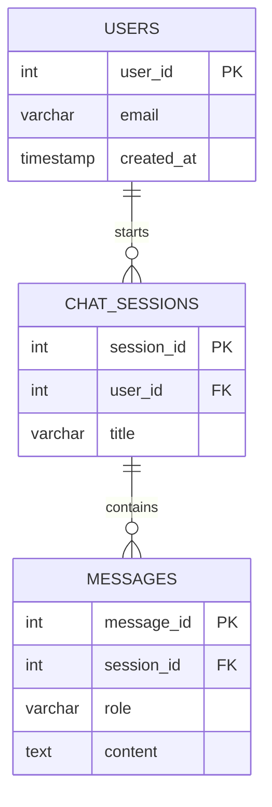

# Module 1.1: SQL Fundamentals

Welcome to the **SQL Fundamentals** module. As an AI Forward Deployed Engineer, you will constantly interact with data. Before you can vectorize text for an LLM or feed context into a LangChain agent, you need to extract that data from the client's enterprise systems. SQL (Structured Query Language) is the universal language of data extraction.

---

## 1. Detailed Theory

### Database Concepts
A Relational Database Management System (RDBMS) stores data in highly structured formats. Unlike JSON documents, relational data guarantees consistency, ACID properties (Atomicity, Consistency, Isolation, Durability), and structure.

### Tables, Rows, and Columns
- **Table**: A collection of related data held in a table format (like a spreadsheet).
- **Column (Field)**: Defines the *type* of data (e.g., `user_name`, `age`).
- **Row (Record)**: A single instance of data populating the columns.

### Data Types
Databases are strictly typed. Common types include:
- `VARCHAR(255)` / `TEXT`: Strings.
- `INT` / `BIGINT`: Integers.
- `FLOAT` / `DECIMAL`: Numbers with decimals.
- `BOOLEAN`: True/False.
- `TIMESTAMP`: Dates and times.

### Constraints
Rules applied to columns to ensure data validity:
- `NOT NULL`: The column must have a value.
- `UNIQUE`: No two rows can have the same value in this column.
- `DEFAULT`: A default value if none is provided.

### Primary Keys & Foreign Keys
- **Primary Key (PK)**: A column (or set of columns) that uniquely identifies each row (e.g., `user_id`). It is inherently `UNIQUE` and `NOT NULL`.
- **Foreign Key (FK)**: A column that establishes a link between data in two tables. It references the Primary Key of another table (e.g., an `author_id` in a `books` table referencing the `id` in the `authors` table).

---

## 2. Architecture Diagram: Relational Data Model

How tables relate to each other in a standard AI Agent memory store.



---

## 3. Production Use Cases

1. **RAG Document Metadata**: When building a RAG system, storing the raw text chunks and their origin document metadata (Author, Date, Access Level) in a SQL table, while storing the embeddings in a Vector DB.
2. **AI Agent Audit Logs**: Regulated industries (Banking, Healthcare) require an immutable audit trail of exactly what an AI Agent did. This is stored in SQL tables heavily reliant on Foreign Keys linking back to the user.
3. **Billing Systems**: Tracking how many API tokens each `organization_id` consumed across multiple projects.

---

## 4. Real Company Examples

- **Scale AI**: Uses massive PostgreSQL tables to manage the relationships between Labelers (Users), Labeling Tasks (Tasks), and the generated annotations (Annotations).
- **Any Enterprise Client**: If you are deployed to an insurance company, their claim data lives in SQL (often Oracle or SQL Server). You cannot build AI for them if you don't understand how their `claims` table relates to their `policies` table.

---

## 5. Coding Examples

### Creating Tables (DDL - Data Definition Language)

```sql
-- 1. Create the Users table
CREATE TABLE users (
    id SERIAL PRIMARY KEY,            -- Auto-incrementing integer
    email VARCHAR(255) UNIQUE NOT NULL,
    is_active BOOLEAN DEFAULT TRUE,
    created_at TIMESTAMP DEFAULT CURRENT_TIMESTAMP
);

-- 2. Create a related Prompts table (Agent History)
CREATE TABLE agent_prompts (
    prompt_id SERIAL PRIMARY KEY,
    user_id INT NOT NULL,
    prompt_text TEXT NOT NULL,
    tokens_used INT DEFAULT 0,
    -- Establishing the relationship:
    CONSTRAINT fk_user 
      FOREIGN KEY(user_id) 
      REFERENCES users(id) 
      ON DELETE CASCADE
);
```
*Note: `ON DELETE CASCADE` means if a User is deleted, all their associated Prompts are automatically deleted.*

---

## 6. Hands-on Labs

**Lab: Database Schema Design**
**Objective**: Model a simple inventory system for an AI Agent that orders office supplies.
**Instructions**:
1. (Mental or Scratchpad): Design an `employees` table with `id` (PK) and `name`.
2. Design a `supplies` table with `id` (PK), `item_name`, and `stock_count`.
3. Design an `orders` table to connect them. It needs `order_id` (PK), `employee_id` (FK), `supply_id` (FK), and `quantity_ordered`.

---

## 7. Assignments

**Assignment: The AI Model Registry**
Write the raw SQL `CREATE TABLE` statements for a system that tracks AI Models.
1. Create a `providers` table (e.g., OpenAI, Anthropic). It needs `provider_id` (PK) and `provider_name` (UNIQUE).
2. Create a `models` table. It needs `model_id` (PK), `model_name` (e.g., "gpt-4"), `context_window` (Integer), and a Foreign Key linking to the `providers` table.

---

## 8. Interview Questions

1. **What is the difference between a Primary Key and a Unique Constraint?**
   *Answer Hint: A Primary Key uniquely identifies a row, cannot be NULL, and a table can only have ONE Primary Key. A table can have multiple Unique constraints, and columns with a Unique constraint can usually contain a NULL value.*
2. **What does a Foreign Key actually do?**
   *Answer Hint: It enforces Referential Integrity. It ensures you cannot insert a record pointing to a non-existent ID, and prevents deleting a record that is still being referenced elsewhere (unless CASCADE is used).*
3. **What is ACID in the context of databases?**
   *Answer Hint: Atomicity (all or nothing), Consistency (valid state to valid state), Isolation (concurrent transactions don't interfere), Durability (saved permanently).*

---

## 9. Best Practices (FDE Standards)

- **Always use meaningful PKs**: Use standard naming like `id` or `user_id`. Avoid natural keys (like using an email address as a Primary Key) because emails can change. Use surrogate keys (UUIDs or Auto-incrementing Integers).
- **Use UUIDs for distributed systems**: If your application creates records across multiple offline devices that sync later, standard integers (1, 2, 3) will clash. UUIDs (Universally Unique Identifiers) prevent this.

---

## 10. Common Mistakes

- **Forgetting `NOT NULL`**: Creating a `users` table where `email` is allowed to be NULL. This will crash your Python application later when you try to send an email to a `NoneType`.
- **String Length Limits**: Setting a `VARCHAR(50)` for a URL column. URLs are often longer than 50 characters; the database will throw a truncation error in production. When in doubt for unknown length strings, use `TEXT`.
