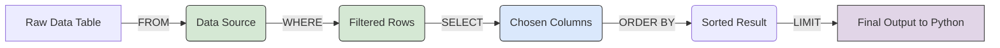

# Module 1.2: Querying Data

Welcome to **Module 1.2**. Creating tables is just the beginning. The bulk of your time will be spent extracting and modifying data. Data Manipulation Language (DML) encompasses the commands used to interact with the data inside your tables.

---

## 1. Detailed Theory

### The Core Commands (CRUD)
- **C**reate: `INSERT INTO` (Adds new rows).
- **R**ead: `SELECT` (Retrieves rows).
- **U**pdate: `UPDATE` (Modifies existing rows).
- **D**elete: `DELETE` (Removes rows).

### Filtering and Sorting
- **`WHERE`**: Filters results based on a condition (e.g., `WHERE age > 18`).
- **`ORDER BY`**: Sorts the output (e.g., `ORDER BY created_at DESC`).
- **`LIMIT`**: Restricts the number of rows returned (Crucial for performance and pagination).
- **`DISTINCT`**: Removes duplicate values from the result set.

### Logical Operators
- `AND`, `OR`, `NOT`
- `IN` (Matches any value in a list)
- `LIKE` (Pattern matching using `%` for wildcards)
- `IS NULL` / `IS NOT NULL`

---

## 2. Architecture Diagram: Query Execution Flow


*Note: SQL clauses are executed in a specific order by the database engine, not necessarily the order they are written in the query!*

---

## 3. Production Use Cases

1. **Context Hydration**: An AI Agent needs to know about a user before chatting. It executes `SELECT preferences, tone FROM user_profiles WHERE user_id = 123`.
2. **Soft Deletes**: Instead of permanently deleting user data (which destroys historical AI logs), you execute `UPDATE users SET is_deleted = TRUE WHERE id = 123`.
3. **Data Scrubbing pipelines**: Running `DELETE FROM agent_logs WHERE created_at < '2023-01-01'` to drop old data before a system migration.

---

## 4. Real Company Examples

- **Stripe**: Handles millions of `INSERT` and `UPDATE` statements per second for financial transactions. They heavily rely on `WHERE` clauses to ensure idempotency (e.g., `UPDATE payments SET status = 'paid' WHERE id = 1 AND status = 'pending'`).
- **Data Engineering (ETL)**: Scripts that run nightly to `SELECT` massive amounts of application data, filter it using complex `WHERE` and `LIKE` conditions, and load it into analytical data warehouses for AI fine-tuning.

---

## 5. Coding Examples

### Inserting Data
```sql
INSERT INTO users (email, is_active) 
VALUES 
    ('alice@enterprise.com', true),
    ('bob@enterprise.com', false),
    ('charlie@enterprise.com', true);
```

### Retrieving and Filtering (The SELECT Statement)
```sql
-- Get all active users
SELECT id, email 
FROM users 
WHERE is_active = true;

-- Find users with 'enterprise' in their email (Pattern Matching)
-- The % means "any sequence of characters"
SELECT * 
FROM users 
WHERE email LIKE '%@enterprise.com';

-- Find the 10 most recent agent prompts that used over 1000 tokens
SELECT prompt_text, tokens_used 
FROM agent_prompts 
WHERE tokens_used > 1000 
ORDER BY created_at DESC 
LIMIT 10;
```

### Updating and Deleting
```sql
-- Reactivate Bob
UPDATE users 
SET is_active = true 
WHERE email = 'bob@enterprise.com';

-- Delete users who never verified their email (Assume a verified_at column exists)
DELETE FROM users 
WHERE verified_at IS NULL;
```

---

## 6. Hands-on Labs

**Lab: The Metadata Filter**
**Objective**: Write a query to filter documents for RAG.
**Instructions**:
Assume a table `documents` with columns `id`, `content`, `author`, `department`, `classification` (Secret, Public).
Write a query to:
1. Select the `content` and `author`.
2. Where the `department` is 'Engineering' OR 'Finance'.
3. And the `classification` is 'Public'.
4. Sort by `id` descending, returning only 5 results.

*Solution:*
```sql
SELECT content, author FROM documents 
WHERE department IN ('Engineering', 'Finance') 
AND classification = 'Public' 
ORDER BY id DESC LIMIT 5;
```

---

## 7. Assignments

**Assignment: Soft Deletion Implementation**
1. You have a table `api_keys` with columns `id`, `key_hash`, `is_revoked`.
2. Write an `UPDATE` statement that sets `is_revoked = true` for a specific `id = 99`.
3. Write a `SELECT` statement that fetches all valid (not revoked) API keys.

---

## 8. Interview Questions

1. **What is the difference between `DELETE` and `TRUNCATE`?**
   *Answer Hint: `DELETE` is a DML command that removes rows one by one and records each deletion in the transaction log (can be rolled back). `TRUNCATE` is a DDL command that instantly deallocates the data pages of the table, making it much faster but riskier.*
2. **What happens if you run an `UPDATE` or `DELETE` statement without a `WHERE` clause?**
   *Answer Hint: Disaster. It will update or delete EVERY SINGLE ROW in the table.*
3. **What is SQL Injection and how do you prevent it?**
   *Answer Hint: When a user inputs malicious SQL commands into a web form that your database executes (e.g., `' OR 1=1; DROP TABLE users;--`). Prevent it by ALWAYS using Parameterized Queries or ORMs (like SQLAlchemy) rather than string formatting/concatenation.*

---

## 9. Best Practices (FDE Standards)

- **Never `SELECT *` in Production**: Always explicitly list the columns you need (`SELECT id, email FROM users`). `SELECT *` fetches unnecessary data, slows down network transfer, and can break application code if a new column is added to the table unexpectedly.
- **Use `IN` instead of multiple `OR`s**: `WHERE status IN ('pending', 'failed', 'retry')` is much cleaner and faster than `WHERE status = 'pending' OR status = 'failed' OR status = 'retry'`.

---

## 10. Common Mistakes

- **Null Comparisons**: Writing `WHERE verified_at = NULL`. This evaluates to Unknown/False in SQL. You MUST write `WHERE verified_at IS NULL`.
- **Case Sensitivity with `LIKE`**: In PostgreSQL, `LIKE 'admin%'` will match 'admin' but not 'Admin'. Use `ILIKE` for case-insensitive matching.
