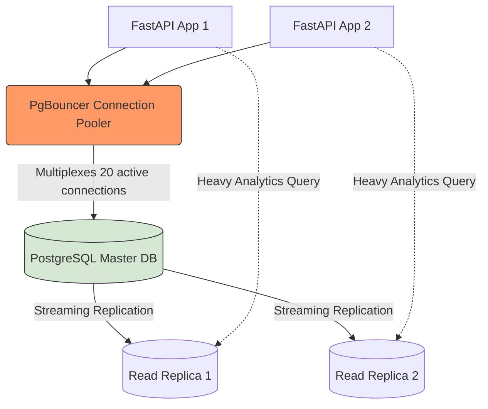

# Module 1.4: Production SQL

Welcome to **Module 1.4**. Writing a `SELECT` statement is easy. Designing a database schema that can handle 10,000 concurrent LLM agent interactions per second without locking up requires deep knowledge of Data Modeling, Normalization, Indexing, and Connection Pooling.

---

## 1. Detailed Theory

### PostgreSQL: The Enterprise King
While MySQL and SQLite have their place, PostgreSQL is the standard for AI FDEs. It supports JSONB (unstructured data indexing), `pgvector` (storing and querying AI embeddings directly in SQL), and massive concurrent workloads.

### Normalization vs. Denormalization
- **Normalization (OLTP)**: Organizing tables to minimize data redundancy. Breaking a massive table into smaller ones linked by Foreign Keys (e.g., 3rd Normal Form - 3NF). Great for high-speed writes (Transactional systems).
- **Denormalization (OLAP)**: Combining tables back together (adding redundancy) to speed up read-heavy workloads (Analytical systems). 

### Indexing
An index acts like a table of contents for a book. Without an index, SQL performs a "Full Table Scan" (O(N)), checking every row. With a B-Tree index, it finds the row in O(log N) time.
- **Rule of Thumb**: Always index Foreign Keys and columns used frequently in `WHERE` clauses.

### Connection Pooling
(Covered briefly in the Python module, applied here). PostgreSQL forks a heavy process for every connection. If 1,000 FastAPI workers try to connect, Postgres will crash. Tools like **PgBouncer** or SQLAlchemy's internal pool sit in front of the database, multiplexing a small number of real database connections across thousands of application clients.

---

## 2. Architecture Diagram: Production PostgreSQL Stack



---

## 3. Production Use Cases

1. **pgvector for RAG**: Instead of managing a separate Pinecone database, using Postgres with the `pgvector` extension to store `(id, content, metadata, embedding(1536))` in a single table, allowing you to run standard SQL `WHERE` clauses *and* semantic vector search in one atomic query.
2. **JSONB for Agent State**: LangGraph workflows generate highly variable state dictionaries. Creating a Postgres table with a `state_data JSONB` column allows you to store unstructured JSON *and* index specific keys within that JSON for fast querying.
3. **Read Replicas for Analytics**: The AI engineering team needs to run heavy `GROUP BY` analytics on agent token usage. Instead of running this on the Master database (slowing down the live application), they route the query to a Read-Only Replica.

---

## 4. Real Company Examples

- **Supabase**: Their entire business model is offering hosted PostgreSQL tailored for modern developers and AI startups, heavily relying on Connection Pooling and `pgvector`.
- **Instagram**: Originally built on a massive PostgreSQL cluster, utilizing extreme sharding and indexing strategies to serve billions of users.

---

## 5. Coding Examples

### Creating an Index
```sql
-- Creating a table for agent conversation logs
CREATE TABLE chat_logs (
    id SERIAL PRIMARY KEY,
    user_id INT NOT NULL,
    session_id VARCHAR(50) NOT NULL,
    message TEXT,
    created_at TIMESTAMP DEFAULT CURRENT_TIMESTAMP
);

-- Without this index, querying a specific user's history will trigger a full table scan.
CREATE INDEX idx_user_session ON chat_logs (user_id, session_id);
```

### Using JSONB
```sql
CREATE TABLE ai_documents (
    id SERIAL PRIMARY KEY,
    document_text TEXT,
    metadata JSONB -- Unstructured metadata!
);

INSERT INTO ai_documents (document_text, metadata)
VALUES ('Q3 Financials', '{"department": "Finance", "tags": ["confidential", "q3"]}');

-- PostgreSQL lets you query INSIDE the JSON natively!
SELECT * FROM ai_documents 
WHERE metadata->>'department' = 'Finance';
```

---

## 6. Hands-on Labs

**Lab: Explain Plan**
**Objective**: Prove that indexes speed up queries.
**Instructions**:
1. Open a local PostgreSQL instance (or mock the concept).
2. Write a `SELECT` statement: `EXPLAIN ANALYZE SELECT * FROM users WHERE email = 'test@test.com';`
3. Notice the output says "Seq Scan" (Sequential Scan).
4. Run `CREATE UNIQUE INDEX idx_email ON users(email);`
5. Run the `EXPLAIN ANALYZE` command again. Notice the output now says "Index Scan" and the execution time has dropped significantly.

---

## 7. Assignments

**Assignment: The Normalization Challenge**
You are given a terrible, denormalized table designed by a junior dev:
`Table: AgentTasks (task_id, prompt_text, user_id, user_email, user_department, provider_name, provider_api_url)`
**Task**: Normalize this into 3NF (Third Normal Form) by designing 3 separate tables linked by Foreign Keys to remove all data redundancy.

---

## 8. Interview Questions

1. **When should you NOT add an index to a column?**
   *Answer Hint: Indexes speed up reads but slow down writes (because the database must update the B-Tree index every time a row is inserted or updated). Do not index tables that are heavily written to (like high-throughput raw log tables) or columns with low cardinality (like a boolean `is_active` column).*
2. **What is JSONB in PostgreSQL and how does it differ from a standard TEXT column storing JSON?**
   *Answer Hint: JSONB stores data in a decomposed binary format. It is slower to insert, but drastically faster to process because it supports indexing (GIN indexes) on keys/values inside the JSON structure.*
3. **What is database Normalization?**
   *Answer Hint: The process of structuring a database to reduce data redundancy and improve data integrity. Usually involves breaking tables down until every non-key column depends solely on the Primary Key.*

---

## 9. Best Practices (FDE Standards)

- **Use UUIDs for Public Facing IDs**: If your FastAPI exposes `/api/users/5`, an attacker knows you have at least 5 users and can try `/api/users/6`. If you use UUIDs (`/api/users/9b1deb4d...`), the ID is unguessable.
- **Connection Pooling is Mandatory**: Never deploy a Python AI app to production without configuring connection pooling in SQLAlchemy (`pool_size=20, max_overflow=10`) or using PgBouncer.

---

## 10. Common Mistakes

- **Indexing Everything**: Believing that "more indexes = faster database." This destroys insert performance and fills up the server's hard drive instantly.
- **N+1 Queries**: (Covered in ORM, but stems from bad SQL). Designing a normalized schema but querying it in a loop from Python rather than using a proper `JOIN`.
