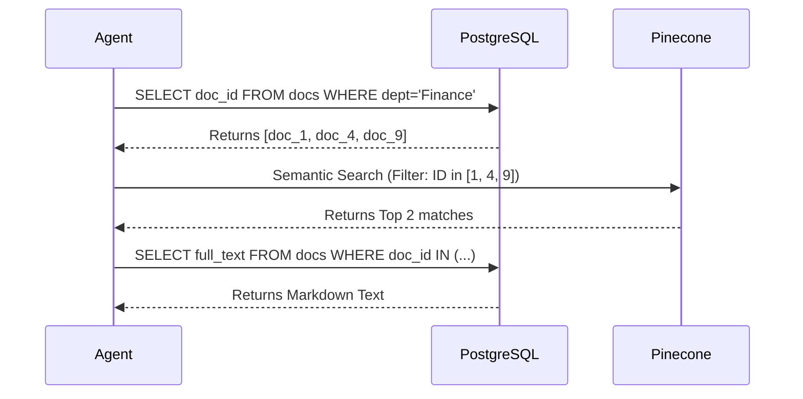

# Module 1.5: AI FDE SQL

Welcome to **Module 1.5**. This is where traditional software engineering meets AI. As an FDE, you will be tasked with designing SQL schemas specifically for Retrieval-Augmented Generation (RAG) metadata, agent state tracking, and generating feature sets for machine learning models.

---

## 1. Detailed Theory

### RAG Metadata Design
Vector Databases (Pinecone, Chroma) are incredible at semantic search but terrible at relational filtering (e.g., "Find documents where author is John AND date > 2022"). An FDE hybrid approach stores the document structure and metadata in PostgreSQL, and only the embeddings in the Vector DB.

### Feature Engineering in SQL
Before training a churn prediction model or fine-tuning an LLM, Data Scientists need clean "Features." You will write massive SQL queries that extract, transform, and aggregate raw database rows into statistical features (e.g., `avg_tokens_per_session`).

### pgvector
An extension for PostgreSQL that allows it to operate as a Vector Database. It introduces the `vector` data type and distance operators (`<->` for Euclidean, `<#>` for inner product, `<=>` for cosine similarity).

---

## 2. Architecture Diagram: Hybrid RAG Search



---

## 3. Production Use Cases

1. **Enterprise Reporting**: The client wants a dashboard showing the ROI of the AI Copilot. You write a SQL query aggregating total time saved (estimated) vs total API cost (calculated via tokens used) grouped by department.
2. **Context Window Assembly**: Before an Agent replies, querying SQL to fetch the user's role, their past 5 resolved tickets, and their current subscription tier to inject into the LLM System Prompt.

---

## 4. Real Company Examples

- **Supabase / Postgres ML**: Entire platforms dedicated to running machine learning models and semantic searches entirely inside the PostgreSQL database using SQL queries, eliminating the need to move data to external Python scripts.

---

## 5. Coding Examples

### pgvector for Semantic Search in SQL
*Assuming the `pgvector` extension is installed on your Postgres server.*

```sql
-- 1. Create a table with a vector column (1536 is OpenAI's dimension size)
CREATE TABLE enterprise_knowledge (
    id SERIAL PRIMARY KEY,
    content TEXT,
    embedding vector(1536) 
);

-- 2. Create an HNSW Index for lightning-fast approximate nearest neighbor search
CREATE INDEX ON enterprise_knowledge 
USING hnsw (embedding vector_cosine_ops);

-- 3. Query: Find the 3 most semantically similar documents to a user's prompt embedding
-- (The embedding array would be injected by Python)
SELECT id, content, 1 - (embedding <=> '[0.1, 0.2, 0.3...]'::vector) AS similarity
FROM enterprise_knowledge
ORDER BY embedding <=> '[0.1, 0.2, 0.3...]'::vector
LIMIT 3;
```

### Feature Engineering (User Engagement)
```sql
-- Calculate how engaged a user is with the AI system
SELECT 
    user_id,
    COUNT(session_id) as total_sessions,
    SUM(tokens_used) as total_tokens,
    MAX(created_at) as last_active_date,
    -- Case statement for categorical feature engineering
    CASE 
        WHEN SUM(tokens_used) > 100000 THEN 'Power User'
        WHEN SUM(tokens_used) > 10000 THEN 'Active User'
        ELSE 'Casual User'
    END as user_tier
FROM agent_chat_logs
GROUP BY user_id;
```

---

## 6. Hands-on Labs

**Lab: Metadata Schema Design**
**Objective**: Design the SQL schema for a hybrid RAG system.
**Instructions**:
Write the `CREATE TABLE` SQL for a `document_chunks` table. It must contain:
- A Primary Key.
- A Foreign Key to a `documents` table.
- The raw `chunk_text`.
- The `vector_id` (A string representing the ID of the embedding stored in Pinecone).
- `token_count`.

---

## 7. Assignments

**Assignment: The AI Audit Query**
The compliance team needs an audit of the LLM usage for the last 30 days.
Write a SQL query that joins `users` (id, department) and `llm_requests` (id, user_id, provider, cost, created_at).
Return the `department`, the `provider`, and the `SUM(cost)`, grouped by department and provider, ordered by the highest cost first.

---

## 8. Interview Questions

1. **Why might you use PostgreSQL with `pgvector` instead of a dedicated Vector DB like Pinecone?**
   *Answer Hint: Architecture simplicity. If all your relational business data is already in Postgres, keeping your vectors there avoids the complexity of synchronizing data between two different databases (the Dual Write problem) and allows you to run JOINs between vector similarity and relational metadata in a single query.*
2. **What is the "Dual Write" problem in hybrid RAG architectures?**
   *Answer Hint: When saving a document, you write the metadata to Postgres and the vector to Pinecone. If Postgres succeeds but Pinecone fails (network error), your databases are out of sync (inconsistent state). Transactional rollbacks across different database systems are incredibly difficult.*

---

## 9. Best Practices (FDE Standards)

- **Soft Delete Vectors Carefully**: If you soft-delete a document in SQL (`is_deleted=True`), it is still in your Vector DB! Your semantic search will return chunks for a deleted document. You must design your system to cascade deletions to the Vector DB, or always apply metadata filters in your vector search (`filter={"is_deleted": False}`).

---

## 10. Common Mistakes

- **Updating Embeddings**: Updating the text of a document in SQL but forgetting to trigger a background job to re-embed the new text and update the Vector DB. The semantic search will now be entirely disconnected from the actual text content.
