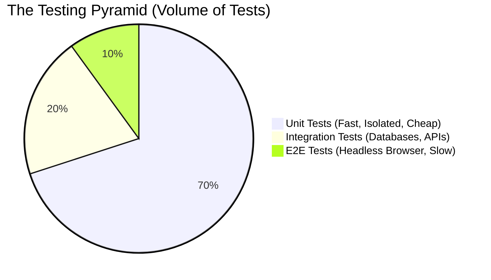

# Module 5.1: Testing Fundamentals

Welcome to the **Testing** module. Code without tests is legacy code the moment it is written. In enterprise AI, if a bad prompt template change is deployed without tests, it could cause an LLM to hallucinate on a live customer service call, leading to immediate PR disasters.

---

## 1. Detailed Theory

### Why Test?
- **Confidence**: Allows you to refactor massive parts of the application and know instantly if you broke something.
- **Documentation**: Well-written tests explain exactly how a function *should* be used.
- **Velocity**: It feels slower today, but it is 100x faster tomorrow because you don't spend hours manually clicking through UI screens to verify a bug fix.

### The Testing Pyramid
1. **Unit Testing**: Testing a single, isolated function or class. (e.g., Does this `extract_json()` function actually return a dictionary?). These should be lightning fast and numerous.
2. **Integration Testing**: Testing how two or more components interact. (e.g., Does my FastAPI endpoint successfully insert a record into the PostgreSQL database?).
3. **Functional / End-to-End (E2E) Testing**: Simulating a real user interacting with the entire system. (e.g., A headless browser clicking a button, triggering a LangGraph workflow, and verifying the final output on the screen). These are slow and brittle.

### The AAA Pattern
Every good test follows this structure:
- **Arrange**: Set up the initial state (create mock data, initialize variables).
- **Act**: Call the function you are testing.
- **Assert**: Verify the output matches your expectations.

---

## 2. Architecture Diagram: The Testing Pyramid



---

## 3. Production Use Cases

1. **Unit Testing Prompts**: Before pushing code, running a unit test that verifies your prompt template successfully injects the `{user_name}` variable without raising a `KeyError`.
2. **Integration Testing RAG**: Spinning up a temporary SQLite database, inserting a mock document, and testing if your LlamaIndex retrieval function actually fetches that document when queried.
3. **E2E Agent Testing**: Sending a complex user query to the `/chat` endpoint and verifying that the final HTTP response contains the correct JSON schema required by the React frontend.

---

## 4. Real Company Examples

- **Palantir**: Enforces 80-90% Unit Test coverage on all Python repositories. Pull Requests are automatically blocked if the coverage drops.
- **Netflix**: Employs "Chaos Engineering", a form of testing where they intentionally break servers in production to ensure their systems gracefully degrade.

---

## 5. Coding Examples

### The AAA Pattern in Python (Using `pytest`)
*Assuming a simple function to test:*
```python
# src/calculator.py
def calculate_cost(tokens: int, cost_per_1k: float) -> float:
    if tokens < 0:
        raise ValueError("Tokens cannot be negative")
    return (tokens / 1000) * cost_per_1k
```

*The Test:*
```python
# tests/test_calculator.py
import pytest
from src.calculator import calculate_cost

def test_calculate_cost_standard():
    # 1. Arrange
    tokens = 2500
    rate = 0.02
    
    # 2. Act
    result = calculate_cost(tokens, rate)
    
    # 3. Assert
    assert result == 0.05

def test_calculate_cost_negative_raises_error():
    # Pytest context manager to assert exceptions!
    with pytest.raises(ValueError, match="Tokens cannot be negative"):
        calculate_cost(-100, 0.02)
```

---

## 6. Hands-on Labs

**Lab: Your First Test**
**Objective**: Run `pytest` locally.
**Instructions**:
1. `pip install pytest`.
2. Create a file `math_ops.py` with `def add(a, b): return a + b`.
3. Create a file `test_math_ops.py`.
4. Inside, write:
   ```python
   from math_ops import add
   def test_add_positive():
       assert add(2, 3) == 5
   ```
5. In your terminal, run `pytest`. Watch the green dot appear!

---

## 7. Assignments

**Assignment: Unit Test the Text Cleaner**
1. You have a function:
   ```python
   def clean_text(text: str) -> str:
       if not text:
           return ""
       return text.strip().lower()
   ```
2. Write a PyTest file `test_clean_text.py`.
3. Write `test_clean_text_normal_string()` to verify "  Hello World  " becomes "hello world".
4. Write `test_clean_text_empty_string()` to verify "" returns "".
5. Write `test_clean_text_none()` to verify passing `None` returns `""` without crashing.

---

## 8. Interview Questions

1. **What is the difference between a Unit Test and an Integration Test?**
   *Answer Hint: A unit test tests a single function in total isolation (no network, no real database). An integration test tests how that function interacts with external systems (like connecting to a real Postgres database or writing to a file system).*
2. **What does the `assert` keyword do in Python?**
   *Answer Hint: It evaluates an expression. If it evaluates to `True`, the program continues. If it evaluates to `False`, it raises an `AssertionError` and crashes (which causes the test to fail).*
3. **If you have 100% test coverage, does that mean your code is bug-free?**
   *Answer Hint: No. 100% coverage just means every line of code was executed during a test. It does not mean you asserted the correct logic, nor does it mean you tested for edge cases (like massive strings, negative numbers, or null bytes).*

---

## 9. Best Practices (FDE Standards)

- **Test Files Location**: Always keep tests in a separate `/tests` directory at the root of your project, mirroring your `/src` directory structure.
- **Naming Conventions**: `pytest` uses "Test Discovery". It only runs files that start with `test_` or end with `_test.py`. Inside those files, it only runs functions that start with `test_`. Follow this strictly.

---

## 10. Common Mistakes

- **Testing the Framework, not your Code**: Writing a test to verify that standard `dict.get()` works. You should trust Python and third-party libraries (like Pandas). Only test *your* custom business logic.
