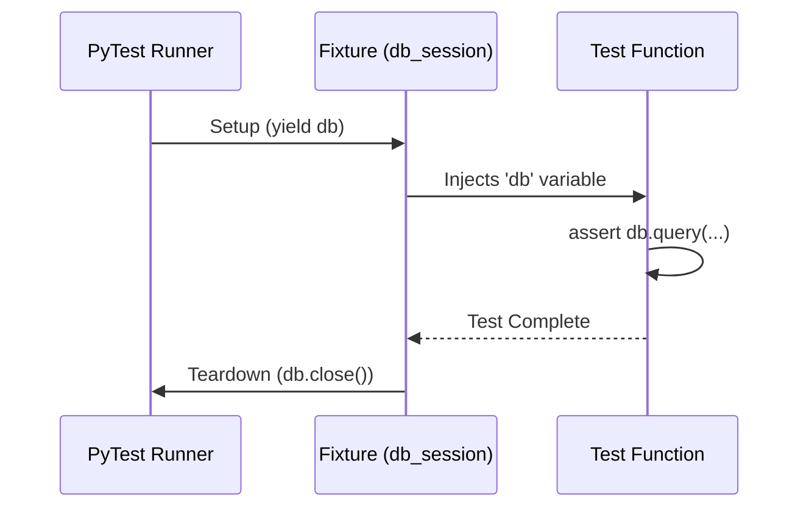

# Module 5.2: PyTest Core Features

Welcome to **Module 5.2**. While you can use Python's built-in `unittest` module, the industry has universally moved to `pytest`. It requires less boilerplate, has incredibly readable assertion errors, and features powerful tools like Fixtures and Parametrization.

---

## 1. Detailed Theory

### Test Discovery
As mentioned, run `pytest` in your terminal. It will recursively search all folders for files named `test_*.py` and execute any function inside them named `test_*()`.

### Powerful Assertions
In standard `unittest`, you have to write `self.assertEqual(a, b)`. In `pytest`, you just write `assert a == b`. If it fails, PyTest uses advanced introspection to print exactly what `a` and `b` were at runtime, making debugging effortless.

### Fixtures
The most powerful feature of PyTest. Fixtures allow you to define reusable setup and teardown code. If 50 tests need a mock Database Connection or a mock User object, you define a `@pytest.fixture` once, and "inject" it into the tests as an argument.

### Parametrization
Do not write 10 separate functions to test 10 different input scenarios. Use `@pytest.mark.parametrize` to run the *same test function* multiple times with different data sets.

---

## 2. Architecture Diagram: PyTest Fixture Lifecycle



---

## 3. Production Use Cases

1. **Fixtures for AI State**: When testing LangGraph, you need a complex `AgentState` dictionary. You create a fixture `mock_agent_state` that returns a perfectly formatted dictionary, injecting it into all 20 of your routing logic tests.
2. **Parametrizing Prompt Guards**: Testing a security filter. You parametrize a test with 50 different malicious prompt injections ("Ignore previous instructions", "System override", "Drop tables"). PyTest runs the filter against all 50 in seconds.

---

## 4. Coding Examples

### Fixtures (Setup & Teardown)
```python
import pytest

class MockDatabase:
    def connect(self): print("Connected!")
    def close(self): print("Closed!")

# Define the fixture
@pytest.fixture
def db():
    # SETUP
    database = MockDatabase()
    database.connect()
    
    # YIELD passes the object to the test
    yield database 
    
    # TEARDOWN runs automatically after the test finishes!
    database.close()

# Use the fixture by just adding it as an argument!
def test_db_exists(db):
    assert db is not None
```

### Parametrization
```python
import pytest

def is_positive(num: int) -> bool:
    return num > 0

# Test 3 different scenarios in one function
@pytest.mark.parametrize("input_num, expected", [
    (5, True),
    (-10, False),
    (0, False)
])
def test_is_positive(input_num, expected):
    assert is_positive(input_num) == expected
```

---

## 5. Hands-on Labs

**Lab: The Setup/Teardown Flow**
**Objective**: Understand the `yield` keyword in fixtures.
**Instructions**:
1. Create `test_fixtures.py`.
2. Write a fixture `tmp_file` that creates a text file `test.txt`, writes "Hello" to it, and `yields` the filepath. After the yield, use `os.remove()` to delete it.
3. Write a test function that takes `tmp_file` as an argument, opens it, and `asserts` the content is "Hello".
4. Run `pytest -s` (the `-s` shows print statements). Verify the file is created and deleted correctly.

---

## 6. Assignments

**Assignment: Parametrize the Tokenizer**
1. You have a mock function `def count_words(text: str) -> int: return len(text.split())`
2. Write a single PyTest function using `@pytest.mark.parametrize`.
3. Provide it with 4 tuples of `(text, expected_count)`:
   - ("Hello world", 2)
   - ("", 0)
   - ("AI is the future", 4)
   - ("   Spaces   ", 1)
4. Run the test and ensure all 4 parameters pass.

---

## 7. Interview Questions

1. **How is a PyTest Fixture different from a standard helper function?**
   *Answer Hint: While both can return data, Fixtures offer automatic dependency injection (PyTest handles calling them based on the argument names), they have built-in teardown capabilities via `yield`, and they have customizable scopes (e.g., running once per test, or once per entire test suite).*
2. **What does `@pytest.fixture(scope="session")` do?**
   *Answer Hint: Normally, a fixture runs before every single test. If a fixture spins up a Docker container, you don't want to do that 500 times. `scope="session"` ensures the fixture runs exactly once at the start of the entire test run, and is shared across all tests, shutting down at the very end.*
3. **How do you run only a specific test file, or a specific test function?**
   *Answer Hint: File: `pytest tests/test_math.py`. Specific function: `pytest tests/test_math.py::test_addition`. Or by keyword: `pytest -k "addition"`.*

---

## 8. Best Practices (FDE Standards)

- **Use `conftest.py`**: If you have fixtures that are shared across multiple test files (like `db_session`), do not import them manually. Put them in a file named `conftest.py` at the root of your `/tests` directory. PyTest automatically discovers them and makes them available globally.
- **Fail Fast**: Run `pytest -x` to stop the test suite on the very first failure. This saves time during debugging rather than waiting for 500 tests to fail cascadingly.

---

## 9. Common Mistakes

- **Mutating Session-Scoped Fixtures**: If you have a `session` scoped database fixture, and Test 1 deletes a user, Test 2 will fail because it expects that user to be there. Tests must be completely idempotent and isolated. If they modify state, use a `function` scoped fixture (the default) so the state is reset every time.
