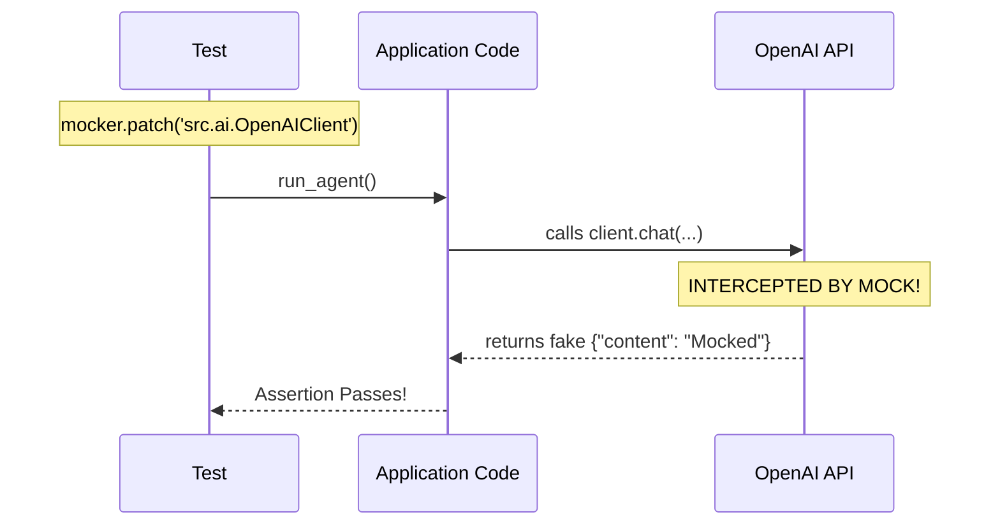

# Module 5.3: Mocking and Patching

Welcome to **Module 5.3**. You cannot write unit tests for an AI application if you don't know how to mock. Every time you run `pytest`, you **must not** make real API calls to OpenAI (it costs money and takes seconds) and you **must not** write to a real production database. Mocking allows you to fake these interactions perfectly.

---

## 1. Detailed Theory

### What is a Mock?
A Mock is a fake object that replaces a real object in your code during testing. You can program a Mock to return specific values, raise specific exceptions, and record exactly how many times it was called.

### `unittest.mock` vs `pytest-mock`
Python has a built-in library `unittest.mock`. However, `pytest-mock` (a third-party plugin) provides a fixture called `mocker` which makes patching vastly cleaner and automatically handles teardown.

### Patch / MonkeyPatch
- **Patching**: Intercepting an `import` in your code and replacing it with a Mock object.
- **Monkeypatching**: Modifying a dictionary, environment variable, or attribute at runtime (e.g., overwriting `os.environ["OPENAI_API_KEY"]` just for the test).

---

## 2. Architecture Diagram: The Patching Process



---

## 3. Production Use Cases

1. **Simulating OpenAI Outages**: You want to test if your FastAPI fallback logic works. You use `mocker.patch` on the OpenAI client to force it to raise an `HTTPError(502)`. Your test asserts that the application gracefully returns a friendly error message instead of crashing.
2. **Avoiding Database Writes**: Mocking the SQLAlchemy `session.add()` method so your unit tests can verify the user-creation logic runs correctly without actually needing a live PostgreSQL server to be running.
3. **Time Travel**: Mocking `datetime.datetime.now()` to return a fixed date in the past to test if subscription expiration logic triggers correctly.

---

## 4. Coding Examples

*Pre-requisite: `pip install pytest-mock`*

### The Code to Test (`src/llm.py`)
```python
import requests

def get_ai_summary(text: str) -> str:
    response = requests.post("https://api.openai.com/v1/completions", json={"prompt": text})
    if response.status_code != 200:
        return "ERROR"
    return response.json()["choices"][0]["text"]
```

### The Test with Mocking (`tests/test_llm.py`)
```python
from src.llm import get_ai_summary

# Notice we use the 'mocker' fixture provided by pytest-mock
def test_get_ai_summary_success(mocker):
    # 1. Arrange: Create a mock response object
    mock_resp = mocker.Mock()
    mock_resp.status_code = 200
    mock_resp.json.return_value = {"choices": [{"text": "Fake AI Summary"}]}
    
    # 2. Patch: Replace requests.post in the EXACT FILE WHERE IT IS USED
    mocker.patch("src.llm.requests.post", return_value=mock_resp)
    
    # 3. Act
    result = get_ai_summary("Analyze this.")
    
    # 4. Assert
    assert result == "Fake AI Summary"
    
def test_get_ai_summary_failure(mocker):
    mock_resp = mocker.Mock()
    mock_resp.status_code = 500
    mocker.patch("src.llm.requests.post", return_value=mock_resp)
    
    assert get_ai_summary("Analyze this.") == "ERROR"
```

---

## 5. Hands-on Labs

**Lab: Monkeypatching Environment Variables**
**Objective**: Safely test code that relies on `.env`.
**Instructions**:
1. Write a function `get_db_url()` that returns `os.environ["DATABASE_URL"]`.
2. Write a test `test_get_db_url(monkeypatch):`. (PyTest provides `monkeypatch` natively).
3. Inside the test, run `monkeypatch.setenv("DATABASE_URL", "sqlite:///memory")`.
4. Assert that calling `get_db_url()` returns `"sqlite:///memory"`.
*(When the test ends, monkeypatch safely reverts the environment variable!)*

---

## 6. Assignments

**Assignment: Asserting Mock Calls**
Mocks don't just return data; they record how they were used.
1. Read the Python docs for `mock.assert_called_once_with()`.
2. Take the `test_get_ai_summary_success` example from Section 4.
3. After the `assert result == ...` line, add a new assertion.
4. Use the patched mock object to assert that `requests.post` was called *exactly once*, and that the JSON argument passed to it was `{"prompt": "Analyze this."}`.

---

## 7. Interview Questions

1. **Why is it important to patch the object where it is *used*, not where it is *defined*?**
   *Answer Hint: If `src.llm` runs `from requests import post`, the `post` function is now bound to the `src.llm` namespace. If you patch `requests.post`, your test won't work because `src.llm` is using its own local reference. You must patch `src.llm.post`.*
2. **What happens if you run a test suite with 500 LLM tests and you forgot to mock the OpenAI API?**
   *Answer Hint: You will make 500 real HTTP requests. It will take 15 minutes to run, it will cost your company money, it will likely hit rate limits causing tests to randomly fail (flakiness), and it violates the principle that Unit Tests must be fast and isolated.*
3. **What is a "MagicMock" in Python?**
   *Answer Hint: A subclass of Mock that pre-implements Python's magic methods (like `__len__`, `__str__`, `__iter__`). If you are mocking an object that you intend to loop over in a `for` loop, you must use a MagicMock.*

---

## 8. Best Practices (FDE Standards)

- **Don't Mock Everything**: If you mock the database, the HTTP client, and the helper functions, your test is only proving that Python's mock library works. Tests should provide confidence. Use mocks for boundaries (external APIs, DBs), but use real objects for internal business logic.
- **Use `responses` for HTTP**: While patching `requests.post` works, using a specialized library like `responses` or `respx` (for httpx) is far cleaner for mocking complex API endpoints in Python.

---

## 9. Common Mistakes

- **Typos in Patch Paths**: Running `mocker.patch("src.llm.request.post")` instead of `requests`. PyTest will silently fail to find it, or throw an AttributeError, and your real API call will execute, taking 5 seconds and confusing you.
