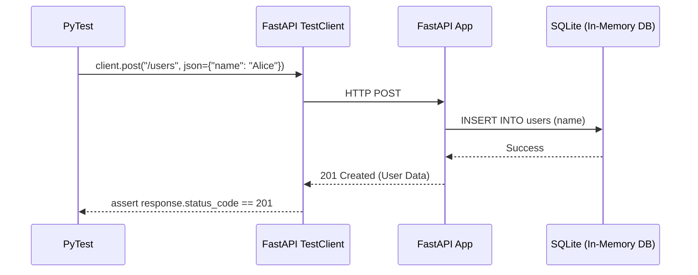

# Module 5.4: API & Database Testing

Welcome to **Module 5.4**. We are moving up the Testing Pyramid from Unit Tests to Integration Tests. As an AI FDE, your core deliverable is often a FastAPI service connected to a Database. You must know how to spin up a Test Client to simulate HTTP requests and a Test Database to simulate SQL queries.

---

## 1. Detailed Theory

### The FastAPI TestClient
FastAPI provides a `TestClient` (built on top of `httpx`). It allows you to send `GET` and `POST` requests directly to your FastAPI `app` object in memory, bypassing the network entirely. It is lightning fast and perfect for verifying routing, Pydantic validation, and response codes.

### Database Testing (The Isolated Sandbox)
You **never** run tests against your production database. You **rarely** run tests against your development database (because tests delete and modify data constantly).
Instead, you configure PyTest to spin up an in-memory SQLite database (or a temporary PostgreSQL container via Docker/Testcontainers) exclusively for the test run.

### End-to-End (E2E) Testing
Using tools like Playwright or Selenium to open a real Chrome browser, click the "Submit Prompt" button on the UI, and verify the AI's response renders on the screen. (FDEs write fewer of these, but must understand them).

---

## 2. Architecture Diagram: API Integration Testing



---

## 3. Production Use Cases

1. **Dependency Overrides**: Your production FastAPI app uses `Depends(get_db)` to connect to AWS PostgreSQL. During testing, you use `app.dependency_overrides[get_db] = get_test_db` to force the endpoint to use your local SQLite test database instead.
2. **Authentication Bypass**: Overriding the `verify_jwt_token` dependency to return a mock Admin User dictionary, allowing you to test secured endpoints without needing to generate cryptographic tokens during PyTest runs.
3. **Regression Testing**: You refactor the Pydantic schemas for the `/v1/chat` endpoint. Running the TestClient ensures you didn't accidentally break backward compatibility for existing mobile apps relying on the old schema.

---

## 4. Coding Examples

### FastAPI TestClient Integration
*Pre-requisite: `pip install httpx`*

```python
from fastapi import FastAPI
from fastapi.testclient import TestClient

# 1. The Application
app = FastAPI()

@app.get("/health")
def health_check():
    return {"status": "ok", "version": "1.0"}

# 2. The Test Setup
client = TestClient(app)

def test_health_check_endpoint():
    # Simulate an HTTP request
    response = client.get("/health")
    
    # Assert HTTP Status Code
    assert response.status_code == 200
    
    # Assert JSON Payload
    assert response.json() == {"status": "ok", "version": "1.0"}
```

### Dependency Overriding (Mocking Auth)
```python
# Assuming this exists in your main.py:
# def verify_token(): return "real_user"
# @app.get("/secure") def secure_route(user = Depends(verify_token))

# In your test file:
def override_verify_token():
    return "fake_admin_user"

# Replace the real dependency with the fake one!
app.dependency_overrides[verify_token] = override_verify_token

def test_secure_route():
    response = client.get("/secure")
    assert response.status_code == 200
    
# Clean up after test
app.dependency_overrides.clear()
```

---

## 5. Hands-on Labs

**Lab: Pydantic Validation Testing**
**Objective**: Verify your API rejects bad data.
**Instructions**:
1. Create a FastAPI app with a `POST /item` endpoint that accepts a Pydantic model requiring `price` (must be a float > 0).
2. Create a `TestClient`.
3. Write a test: `client.post("/item", json={"price": -5.0})`.
4. Assert that `response.status_code == 422` (Unprocessable Entity).
5. Assert that `"price"` is somewhere in the `response.text` (verifying the error message points to the right field).

---

## 6. Assignments

**Assignment: The Database Fixture**
Write a PyTest fixture that sets up an isolated database for every test.
1. Create a fixture `@pytest.fixture() def test_db():`.
2. Inside, setup an SQLite in-memory engine: `create_engine("sqlite:///:memory:")`.
3. Create all tables: `Base.metadata.create_all(bind=engine)`.
4. Create a session, `yield` the session to the test.
5. After the yield, drop all tables `Base.metadata.drop_all(bind=engine)` and close the session.

---

## 7. Interview Questions

1. **Why is it beneficial to use `app.dependency_overrides` instead of `mocker.patch` for API testing?**
   *Answer Hint: Patching requires knowing the exact internal import path of the dependency, which makes tests brittle if you reorganize files. `dependency_overrides` operates at the FastAPI framework level, cleanly swapping the function reference regardless of where it lives in the folder structure.*
2. **What is an in-memory SQLite database, and why is it used for testing?**
   *Answer Hint: A database (`sqlite:///:memory:`) that exists entirely in RAM. It is destroyed instantly when the process ends. It is incredibly fast, requiring no disk I/O, making it perfect for spinning up fresh database states for hundreds of unit tests in seconds.*
3. **If your production DB is PostgreSQL, is testing against SQLite safe?**
   *Answer Hint: Mostly, but not completely. SQLite doesn't support advanced Postgres features like `JSONB` or `pgvector`. If your code uses these, SQLite tests will crash. In that case, you must use Docker (Testcontainers) to spin up a real ephemeral Postgres instance for your test suite.*

---

## 8. Best Practices (FDE Standards)

- **Use Testcontainers for Vector DBs**: You cannot easily "mock" a semantic vector search. Use the `testcontainers` Python library to spin up a temporary Chroma or Qdrant Docker container during test setup, ingest a few vectors, test the retrieval logic, and tear the container down.
- **Keep Tests Isolated**: Test A should not insert a user that Test B relies on. Every test should start with a blank database and create exactly the data it needs to run.

---

## 9. Common Mistakes

- **Forgetting `.json`**: `client.post("/route", data={"name": "Alice"})` sends form-data. FastAPI expects JSON. You must use `client.post("/route", json={"name": "Alice"})`. This causes countless confusing 422 errors for beginners.
