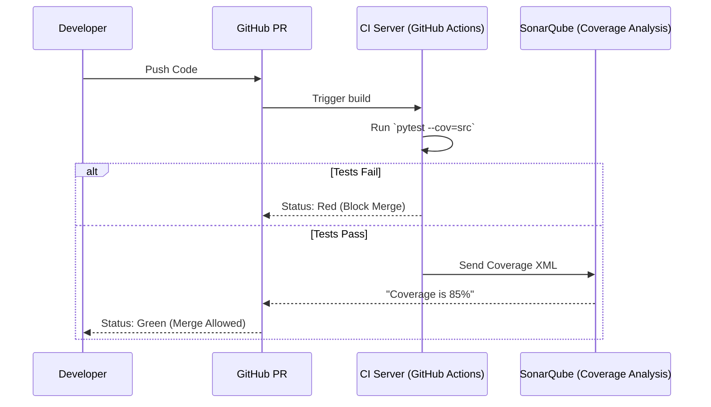

# Module 5.5: Production Testing & Coverage

Welcome to **Module 5.5**. Writing tests is good. Knowing *how much* of your code is actually tested is better. Production environments require mathematical proof of reliability before code is allowed to merge. This is where Coverage and Load Testing come in.

---

## 1. Detailed Theory

### Test Coverage (`pytest-cov`)
Test coverage measures the percentage of your source code lines that were executed during a test run. If you have an `if` statement, and your tests only cover the `True` condition, the `False` branch is "uncovered."
- **Line Coverage**: The percentage of physical lines of code executed.
- **Branch Coverage**: A stricter metric ensuring every possible path through `if/else` statements is executed.

### CI/CD Testing
Running `pytest` locally is not enough (developers forget). Production systems use GitHub Actions or GitLab CI to run the full PyTest suite on a fresh Linux virtual machine for every Pull Request. If tests fail, the PR cannot be merged.

### Performance & Load Testing
Does your AI API work when 1 user hits it? Yes. Does it work when 10,000 users hit it simultaneously? Probably not. 
- **Load Testing**: Simulating massive concurrent user traffic to find the breaking point (the bottleneck). Tools: `Locust` (Python-based), `k6`, or `JMeter`.

---

## 2. Architecture Diagram: CI/CD Testing Gate



---

## 3. Production Use Cases

1. **The 80% Rule**: Enforcing a branch protection rule in GitHub that rejects any PR that drops the total repository test coverage below 80%. This forces FDEs to write tests for their new AI agents immediately, preventing tech debt.
2. **Locust for Vector DBs**: Before launching a RAG feature to 50,000 enterprise users, writing a Locust script that spams the `/search` endpoint with 500 concurrent requests per second to see if Pinecone rate-limits you or if the FastAPI server crashes from CPU exhaustion.

---

## 4. Coding Examples

### Generating a Coverage Report
*Pre-requisite: `pip install pytest-cov`*

```bash
# Run tests and calculate coverage for the 'src' directory
$ pytest --cov=src tests/

# Generate a beautiful HTML report you can open in your browser
$ pytest --cov=src --cov-report=html tests/
# (Open htmlcov/index.html to see exactly which lines of code are missing tests!)
```

### A Basic Locust Load Test
*Pre-requisite: `pip install locust`*

*(File: `locustfile.py`)*
```python
from locust import HttpUser, task, between

class APIUser(HttpUser):
    # Wait between 1 and 5 seconds between tasks
    wait_time = between(1, 5)

    @task
    def test_health_check(self):
        # Hits GET /health
        self.client.get("/health")

    @task(3) # Runs 3x more often than the health check
    def test_ai_generation(self):
        # Hits POST /chat with a payload
        self.client.post("/chat", json={"prompt": "Hello!"})
        
# Run in terminal: `locust -f locustfile.py`
# Then open http://localhost:8089 to start the swarm!
```

---

## 5. Hands-on Labs

**Lab: Chase 100% Coverage**
**Objective**: Use the HTML coverage report to find gaps.
**Instructions**:
1. Create `logic.py`:
   ```python
   def evaluate_score(score):
       if score > 90: return "A"
       elif score > 80: return "B"
       else: return "C"
   ```
2. Create `test_logic.py` and write ONLY one test that passes `95` to the function and asserts it equals `"A"`.
3. Run `pytest --cov=logic --cov-report=term-missing`.
4. Look at the terminal output. It will tell you that the lines containing "B" and "C" were completely missed!
5. Add two more tests to achieve 100% coverage.

---

## 6. Assignments

**Assignment: The CI/CD YAML**
Write a GitHub Actions YAML file (`.github/workflows/test.yml`) that:
1. Triggers on `push` to `main`.
2. Runs on `ubuntu-latest`.
3. Installs Python 3.10.
4. Installs `pytest` and `pytest-cov`.
5. Runs the tests with coverage and fails the build if the coverage is below 90%. *(Hint: `pytest --cov=src --cov-fail-under=90`)*.

---

## 7. Interview Questions

1. **Why might 100% test coverage be a bad goal for an engineering team?**
   *Answer Hint: Law of diminishing returns. Getting from 0% to 80% catches critical business logic bugs. Getting from 80% to 100% often forces developers to write useless, brittle tests for obscure boilerplate code (like testing standard library exception strings), slowing down feature development without adding real value.*
2. **What is the difference between Load Testing and Stress Testing?**
   *Answer Hint: Load testing verifies the system works under expected peak traffic (e.g., Black Friday sales). Stress testing pushes the system far beyond expected limits until it crashes, purely to observe *how* it fails and if it recovers gracefully.*

---

## 8. Best Practices (FDE Standards)

- **Cover the Happy Path first**: Always write integration tests for the primary "Happy Path" (User logs in -> Asks AI -> Gets Answer) before writing 50 unit tests for obscure edge cases.
- **Run Locust locally**: Before pushing to a CI environment, run a small 10-user Locust swarm against your local FastAPI Docker container to ensure you didn't introduce massive memory leaks.

---

## 9. Common Mistakes

- **Testing the Mock**: If you mock `get_user_from_db()` to return `{"name": "Alice"}`, and then your test asserts that `user["name"] == "Alice"`, you have 100% coverage but you've tested nothing. You just tested that your mock returns what you told it to return. You must test the *logic that processes* the mock.
