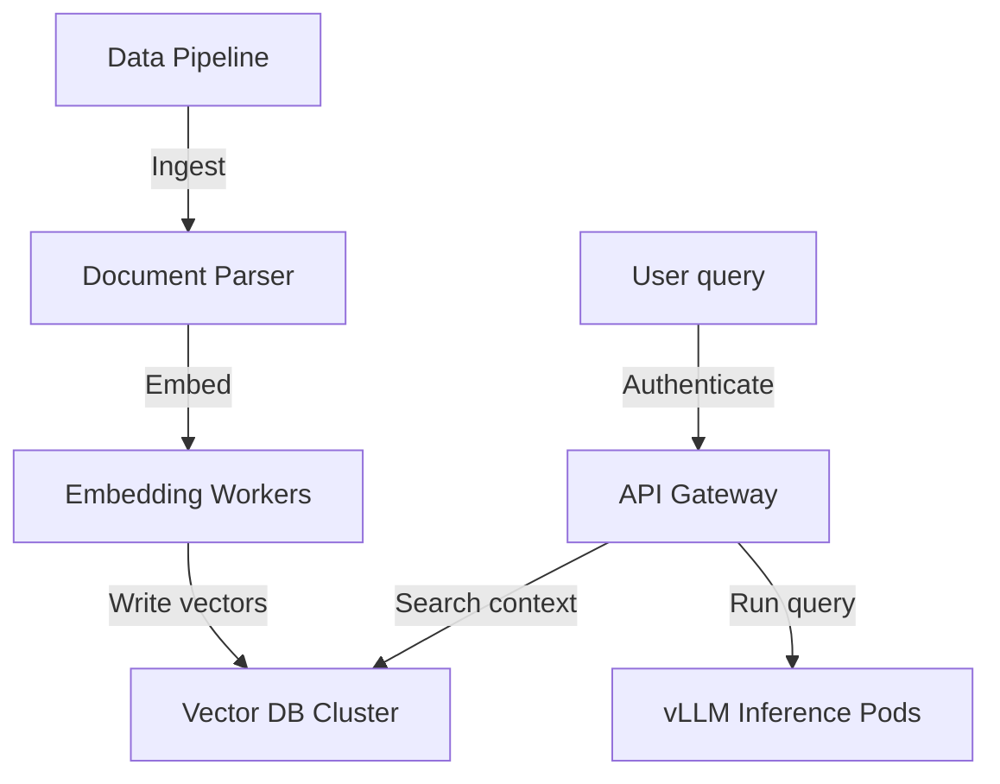
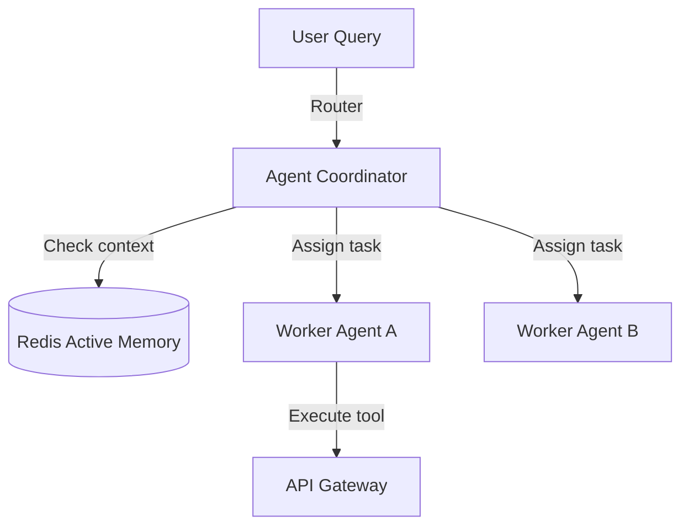
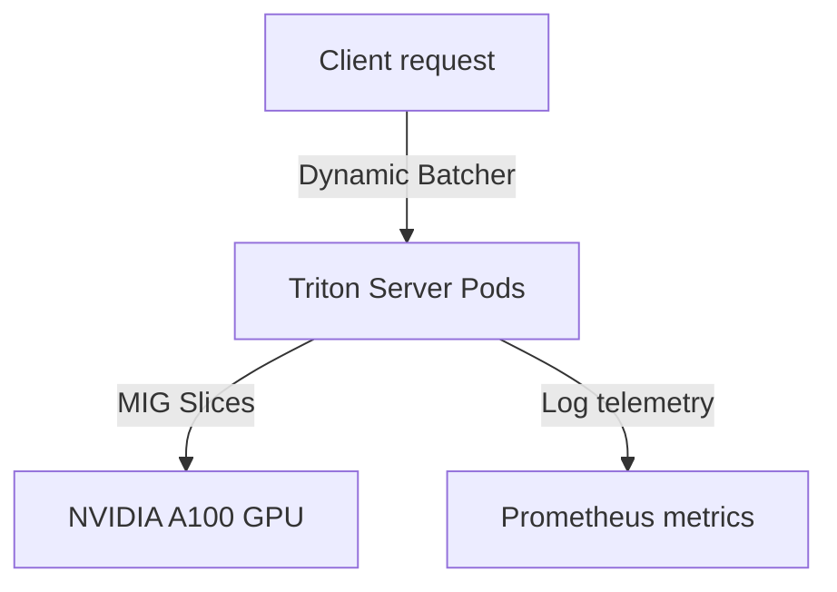
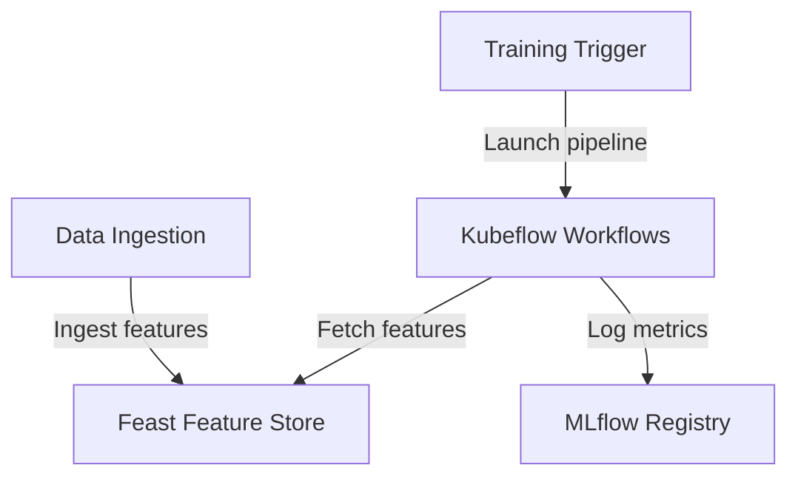

# Module 9: Enterprise Capstone System Design Projects

This module outlines the architectures, requirements, and deployment steps for the five enterprise capstone system design projects.

---

## Project 1: Enterprise RAG Platform

### Overview
Design a globally scalable, highly available RAG platform that processes millions of documents and serves them securely via vector search databases.

### Key Requirements
*   **Scale**: 1 Million Documents, 10,000 Concurrent Queries.
*   **Security**: Enforce RBAC access policies at the document level.
*   **Components**: Document ingestion parser, embedding model worker pool, sharded Qdrant vector database, and MLflow registry.

### System Architecture Diagram


---

## Project 2: Enterprise Multi-Agent Platform

### Overview
Build a stateful, multi-agent orchestration platform managing task routing, tool calling, and long-term memory across agents.

### Key Requirements
*   **Frameworks**: LangGraph, CrewAI.
*   **Memory Layer**: Redis for active sessions, PostgreSQL for long-term audit logs.
*   **Routing**: Dynamic agent routing based on query complexity.

### System Architecture Diagram


---

## Project 3: Enterprise AI Inference Platform

### Overview
Design an inference serving platform deploying Triton and vLLM on Kubernetes worker nodes.

### Key Requirements
*   **Scale**: 50,000 Requests Per Second (RPS).
*   **Scheduling**: GPU Operator managing MIG allocations.
*   **Optimization**: Dynamic batching and model concurrency configurations.

### System Architecture Diagram


---

## Project 4: Enterprise MLOps Platform

### Overview
Build an end-to-end machine learning platform managing training pipelines, feature store cataloging, and monitoring.

### Key Requirements
*   **Orchestration**: Kubeflow Pipelines.
*   **Feature Store**: Feast (using Redis online).
*   **Tracking**: MLflow experiment tracking.

### System Architecture Diagram


---

## Project 5: Enterprise AI SaaS Platform

### Overview
Design a multi-tenant AI SaaS platform serving billing clients with isolated namespaces, usage metering, and Keycloak authentication.

### Key Requirements
*   **Multi-Tenancy**: Separate PostgreSQL schemas and isolated Kubernetes namespaces.
*   **Security**: Keycloak SSO and role mappings.
*   **Billing**: Redis tracking token consumption.

### System Architecture Diagram
```mermaid
graph TD
    A[Tenant User] -->|Authenticate| B[Keycloak Gate]
    B -->|Route traffic| C[Tenant Namespace (Bank A)]
    C -->|Log tokens| D[(Redis Billing Meter)]
    D -->|Export stats| E[Stripe Invoicing]
```
