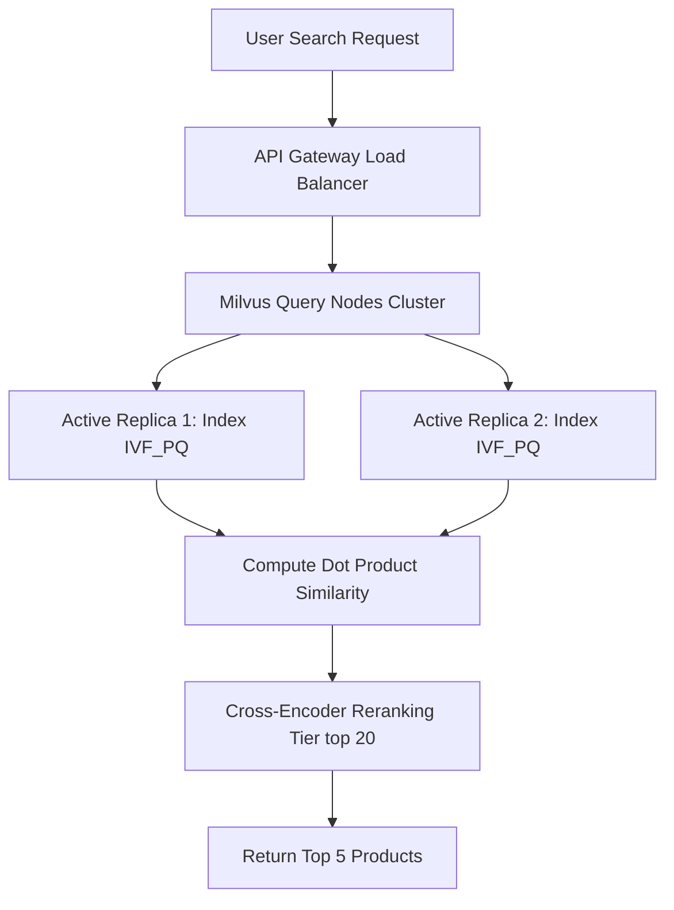

# Enterprise Vector Databases & Search Interview Preparation

This guide compiles advanced interview questions, architectural case studies, and scenarios covering the entire spectrum of vector databases (Pinecone, ChromaDB, Weaviate, Milvus, FAISS), hybrid search strategies, retrieval optimization, agent memory systems, and system design patterns.

---

## 1. Managed vs. Open Source Databases (Pinecone, ChromaDB, Weaviate, Milvus, FAISS)

### Q1: Compare the architectural trade-offs of deploying Pinecone (Serverless API) vs. Milvus (Kubernetes Cluster) for a billion-scale vector dataset.
**Answer:**
- **Pinecone (Serverless Managed API):**
  - **Trade-offs:** Zero infrastructure management, automatic scaling, and pay-per-use billing. However, data must route outside the corporate network to Pinecone's cloud, and custom indexing customizations are restricted.
  - **Best Fit:** Applications with variable traffic and teams that want to minimize infrastructure overhead.
- **Milvus (Distributed Kubernetes Cluster):**
  - **Trade-offs:** Complete control over data storage, networking, and index parameters (e.g. IVF, HNSW, PQ settings). However, it requires dedicated DevOps resources to manage Kubernetes pods, MinIO storage nodes, and query/data node scaling.
  - **Best Fit:** On-premise enterprise platforms with strict security guidelines and continuous, high-volume query traffic.

---

## 2. Hybrid & Semantic Search Optimization

### Q2: How does Reciprocal Rank Fusion (RRF) solve the score merge mismatch problem in hybrid search pipelines?
**Answer:**
- **Score Merging Issue:** Dense vector search produces scores between 0 and 1, while sparse BM25 keyword search generates scores between 0 and 20+, making it difficult to combine scores directly.
- **RRF Solution:** Instead of merging raw scores, RRF evaluates the relative positions (ranks) of documents in both search lists.
- **Formula:** The RRF score for document $d$ is:
  $$RRF(d) = \sum_{m \in M} \frac{1}{k + r_m(d)}$$
  (where $r_m(d)$ is the rank position of document $d$ in search list $m$, and $k$ is a constant, usually set to 60). This produces a balanced, merged ranking list without requiring manual score tuning.

---

## 3. Retrieval Optimization & Chunking

### Q3: Explain the "Lost in the Middle" problem in RAG architectures and how to prevent it.
**Answer:**
- **Problem:** Decoder-only transformer models focus their attention on tokens at the very beginning and very end of prompts, often ignoring data in the middle of long contexts.
- **Defensive Strategies:**
  1. **Reranking:** Apply cross-encoder rerankers to select the top 3-5 most relevant document chunks.
  2. **Context Placement:** Place the most important retrieved documents at the top and bottom of the prompt context window.
  3. **Context Trimming:** Keep overall prompt sizes small to prevent the context window from overloading.

---

## 4. Agent Memory Systems

### Q4: How do you design a tiered memory architecture for multi-agent platforms using vector databases?
**Answer:**
- **Tier 1 (Short-Term Active Context):** Active thread dialogues and intermediate variables stored in high-speed, low-latency caches (like Redis) to support quick updates.
- **Tier 2 (Long-Term Episodic Memory):** Periodic summaries of past agent actions and user preferences generated by low-cost models, stored in vector databases (like ChromaDB or Pinecone).
- **Tier 3 (Semantic Knowledge Bases):** General company documentation, policies, and files indexed in vector databases to support RAG query lookups.

---

## 5. System Design Case Studies

### Case Study: Billion-Vector E-Commerce Search Engine
**Scenario:** Design a search engine to support 100,000 queries per minute over a catalog of 200 million product embeddings, with latency under 100ms.

**Architecture:**

1. **Index Compression (Product Quantization):** Use IVF_PQ index types to compress vector dimensions, reducing index sizes to fit memory limits and keeping queries fast.
2. **Horizontal Scaling:** Run Milvus on Kubernetes to scale query nodes independently and handle heavy query traffic.
3. **Multi-Replica Routing:** Set up database replicas across multiple availability zones and use load balancers to route queries, ensuring high availability and low latency.
